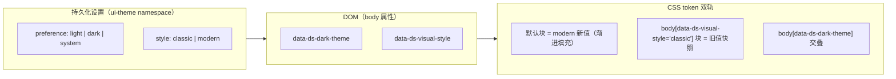

# DeepSeek Harness Web UI 视觉升级计划书

版本：v1（待评审）
状态：**计划书，未实施**。本文只定义方案、范围、路线与验收，不动任何代码。

## 1. 背景与目标

### 1.1 背景

DeepSeek Harness 的 Web GUI（`dsh web`，默认 `http://127.0.0.1:3080`）已具备完整的功能骨架：三栏工作台（侧边栏 | 会话 | 详情）、事件溯源的实时流式会话、工具卡片、队列、审批、设置等。但视觉语言停留在"功能正确"阶段：设计 token 体系是早期从 Figma 导出的静态资产，缺少成体系的圆角、阴影层级、动效曲线与间距尺度；布局、会话、输入区的视觉层次和微交互与当下主流 AI 工作台（ChatGPT / Claude / Cursor / Vercel / Linear 等）有明显差距。

本次升级的目标不是推倒重来，而是在**不破坏架构纪律与产品功能**的前提下，把视觉与交互质感提升到一线 AI 工具水平，形成可长期演进的统一设计语言。

### 1.2 目标

1. 建立**完整的设计 token 体系**（颜色/圆角/阴影/动效/间距/字体），浅色与深色双主题同时精修。
2. 三栏工作台、会话区、输入区、侧边栏四大主视觉面完成一轮**流行风格化**改造。
3. 引入**统一动效语言**（进入/退出/流式/骨架/微交互），并完整尊重 `prefers-reduced-motion`。
4. 所有改动通过既有质量门禁：`pnpm run test:gui`、`DSH_SNAPSHOT=replay pnpm run test:web`、每文件 100% 覆盖率。
5. 交付物附带**改造前后对照截图**与一份视觉验收清单，供评审。

### 1.3 成功标准（可度量）

- 全部视觉改动走语义 token，`grep` 不到 feature 组件中的字面色值（除既有豁免）。
- 深浅两主题均无对比度违规（正文 ≥ 4.5:1，大字号 ≥ 3:1）。
- 动效开关关闭（`prefers-reduced-motion`）时，无位移/闪烁类动画残留。
- `test:gui` 全绿；可见输出变化处 `test:web`（replay 模式）全绿。
- 渲染性能不回退：流式消息更新、工具卡片展开等热路径无新增 layout thrash（用现有 perf 测试佐证）。

## 2. 现状审计

### 2.1 技术栈（已核实）

| 项 | 现状 |
|---|---|
| 框架 | React 18 + TypeScript strict；构建 Vite + tsdown |
| 样式 | CSS Modules + `clsx`；**明确禁止组件库与 Tailwind**（[docs/web-styling.md](docs/web-styling.md)） |
| Token | `packages/client/ui-theme/src/styles/`：`design-platform.css`（static 色板 + alias 语义 token）、`base.css`（字体栈/动效曲线）、`gradient-shadow-text.css`（渐变/阴影/字体 token）、`scrollbar.css`、`shiki.css` |
| 主题 | light / dark / system，`body[data-ds-dark-theme]` 切换，`ui-theme` 的 ThemeRuntime 负责 |
| 布局 | `ui-layout`：三栏 `AppFrame`（sidebar \| conversation \| details），拖拽手柄 + rAF 节流 + 响应式折叠（`columns.ts`） |
| 组件原语 | `ui-primitives`：Button/Input/Menu/Modal/Toast/Tooltip/Pill/StateDot/HoverCard/DisclosureRow/DiffBlock/ReadBlock/SearchBlock/WebBlock/TerminalBlock/JsonTree/OnboardingSurface；markdown 渲染（CodeBlock+shiki/katex/JsonBlock/MessageText）；内联 SVG 图标集 `icons/index.tsx` |
| 会话区 | `ui-conversation`：ChatView/MessageItem/AssistantMarkdown/ReasoningRow（思考过程）/工具节点/QueueDock/ContextMeter/EmptyHero/InputBar/ApprovalPanel/TodoPanel/DetailsPanel |
| 工具区 | `ui-tool`：ToolCallTree/ToolDetails/ToolRow + toolviews（bash/read/search/web/todo/diff 等） |

### 2.2 现有设计体系资产（可复用）

- 完整的 **`--dsw-static-*` 色板**：DeepSeek 品牌蓝（`deepseek-400/500` 等）、中性 bluish 全阶、红/绿/琥珀语义色。
- 较全的 **`--dsw-alias-*` 语义层**：bg-layer、border-l1..l4、label-primary/secondary/tertiary、state-*、button-*、sidebar 系列。
- **markdown 字体 token**（h1-h4/base/strong/italic/code/table）与界面字号 token（xxxs-11 到 xl-24）。
- 阴影与渐变 token（`--dsw-shadow-lv1..3`、`--dsw-linear-gradient-think`）。

### 2.3 主要短板（改造着力点）

1. **缺少设计尺度 token**：无统一圆角（radius）、间距（space）、动效时长/曲线、z-index、断点体系 → 组件间观感不一致。
2. **阴影层级单薄**：lv1-3 均为低对比细微阴影，深色模式缺少层叠感；浮动层（菜单/模态/命令面板）无玻璃拟态。
3. **布局是"平铺三栏"**：栏与栏之间缺乏容器感（卡片化/层级化），窄屏折叠态偏朴素。
4. **会话区信息密度与节奏平淡**：消息进入无过渡、流式渲染无平滑/光标、思考过程折叠无动画、日期分隔/引用样式弱、空状态 hero 无品牌感。
5. **输入区**：浮动感与流行输入卡（大圆角、聚焦光环、发送/停止切换动效）有差距；缺少 ⌘K 命令面板入口。
6. **动效不成体系**：`base.css` 只有一条 `--ds-ease-in-out` 曲线与 0.1/0.2/0.3s 时长，组件各自为政；无骨架 shimmer、无状态点动画。
7. **图标集**：需统一描边粗细（1.5px）、圆角端点与 24px 网格对齐。
8. **深色模式**：大量 alias 直接指向同一静态色阶，层级区分不足（bg-layer-1/2/3 在浅色下全部同值）。

### 2.4 必须遵守的约束与红线（不变量）

- **无组件库、无 Tailwind**；CSS Modules + `clsx`。
- feature 组件只消费 `--dsw-alias-*` 语义 token，**不写字面色值**；主题分支只属于 `ui-theme` 的样式表。
- **组件 props 四份额纪律**：`PropsRuntime` / `PropsRenderSlots` / `PropsStore` / inject face，全部派生，不手写。
- **slot 纪律**：UI 组合只经 `ctx.slots.register`；新增可见 UI 区域须走 slot 声明，不能绕过。
- **web 层纯展示**：不把"如何绘制"写进 session log；可见 UI 变化若涉及新模型可见输入仍需会话事件（本方案不引入模型可见输入）。
- **可访问性**：保留键盘焦点可见性；所有动效尊重 `prefers-reduced-motion`。
- **测试门禁**：任何 GUI 改动 → `pnpm run test:gui`；改变可见组装输出 → `DSH_SNAPSHOT=replay pnpm run test:web`；每文件 100% 覆盖率（不可达分支须有真实理由的 `v8 ignore` 注释）。
- **快照纪律**：UI 视觉变化会改变 replayed e2e 快照。只有在**确认是有意的输出变更**后才 `DSH_SNAPSHOT=refresh`；用 `record` 需真实 key，留给 CI 或专人。
- **文案**：产品文案中文，代码注释英文。
- 非平凡改动需同 PR 携带 Agent Note（GUI 既有笔记是延续先例）。

## 3. 设计愿景：现代 AI 工作台设计语言

以 2024-2026 年一线 AI 工作台的共性审美为基准，结合 DeepSeek 品牌（蓝 + 蓝紫渐变），确立六条风格支柱：

| 支柱 | 描述 | 流行参照 |
|---|---|---|
| **柔和中性基底** | 浅色用暖/冷中性低饱和背景（非纯白），深色用蓝黑中性（非纯黑）；大面积留白，信息密度让位于呼吸感 | ChatGPT / Claude / Linear |
| **品牌渐变点缀** | 品牌蓝为主强调色，蓝→紫罗兰渐变用于品牌词标、hero、聚焦光环等"品牌时刻"，功能元素仍用语义色 | DeepSeek 官网 logo、Vercel |
| **大圆角 + 轻描边** | 容器 12–16px、卡片 8–12px、控件 6–8px；1px 低对比描边（`border-l2` 系）代替重边框 | macOS 风格、Cursor |
| **层级化阴影 + 玻璃拟态** | 浮动层用柔和多层阴影；菜单/命令面板/浮条可用 `backdrop-filter: blur` 玻璃质感，深色模式尤其出彩 | Raycast / Arc / Warp |
| **克制的动效** | 统一 ease/spring 曲线，120–200ms 微交互、300ms 面板、流式消息平滑渲染；一切可被 reduced-motion 关闭 | Linear / Raycast |
| **排版层次** | 明确的字阶/字重/行高节奏；代码块、表格等富内容精细排版；等宽字体保持列对齐 | GitHub Copilot / Cursor |

深色模式不是"反转"，而是**同层级映射**：alias token 在深色下重新指向更亮的阶，保证层级可读。

## 4. 设计原则

1. **Token 先行，组件跟进**：先补齐/修正 `ui-theme` 的 token 体系，所有组件改动只消费语义 token。
2. **语义即契约**：新增 token 按语义命名（`--dsw-alias-*`），不新增"用途内联"的字面量。
3. **浅深同构**：每个语义 token 在两种主题下都有定义；浅色先定稿，深色同步映射。
4. **展示与行为分离**：本方案全部改动落在展示层（`src/client/` + `ui-theme` 样式表），不触碰数据对象层、RPC、会话日志。
5. **小而连续的 PR**：每个模块一个独立 PR，各自绿门禁；不做"一次性大改"。
6. **动效有开关**：任何动画都必须能被 reduced-motion 关闭；不用动画承载必要信息。
7. **性能为红线**：流式热路径不做新订阅、不做重排；动画只作用于 transform/opacity。
8. **可访问性不妥协**：对比度、焦点环、键盘路径与改造前等价或更好。

## 4.5 风格切换与退回（classic / modern 双轨）

**用户要求**：升级上线后必须保留风格切换与退回能力——用户可在"经典（升级前观感）"与"现代（新设计）"之间随时切换，退回零成本。

**机制**：视觉风格建模为与 light/dark/system 正交的第二个偏好维度，走 token 层双轨映射：

要点：

1. **classic 快照即"退回"承诺**：`design-platform.css` 中 `body[data-ds-visual-style="classic"]`（含 `[data-ds-dark-theme]` 交叠）固化上线前的全部 alias/specific token 值；此后每个模块改造只改默认（modern）块的值，classic 块不动。切换只是属性增减，**无 JS 重算、无组件重挂载**，即时生效。
2. **默认 modern**：`DEFAULT_VISUAL_STYLE = 'modern'`。上线初期两轨值相同（机制先落地、观感渐进），随 M2–M8 逐步拉开差异，classic 始终等于"改造前观感"。
3. **持久化**：`ui-theme` settings namespace 新增 `style` 字段（schemastery schema 默认 `modern`），与 `preference` 同一 scope、同一 revision 语义。
4. **运行时链路**：`ThemeRuntime` 持有 `style` 并随 snapshot 发布；`ThemePresenter`（ui-layout）写 `body[data-ds-visual-style]`；Host boot script 同步注入（防首帧闪烁），与 `data-ds-dark-theme` 完全同构。
5. **设置入口**：Appearance 行新增"视觉风格：经典 / 现代"选择器，复用 themeCube 交互模式。
6. **新资产策略**：`scales.css`（radius/space/motion/z/shadow/渐变/玻璃）是两风格共用的尺度体系，只定义一次；风格差异集中在色彩/层级 alias 值。
7. **退回边界承诺**：classic 覆盖"改造前已存在的所有区域"的 token 值；M2–M8 新增的区域（命令面板等）在两风格下共用新组件样式，仅色彩/层级随 token 切换——观感协调，不承诺"经典 = 像素级复刻旧布局"。

## 5. 分模块改造方案

> 每个模块给出：现状 → 目标 → 具体措施 → 涉及文件 → 验收。模块间按 [§7 路线图](#7-分阶段实施路线图) 排序实施。

### M1 设计 Token 与主题体系（基础，先行）

**现状**：`design-platform.css` 有 static 色板与 alias 层，但缺圆角/间距/动效/z-index/断点 token；浅色下 `bg-layer-1/2/3` 同值，深色层级偏弱。

**措施**：
1. 在 `ui-theme/src/styles/` 新增 `scales.css`（或并入 design-platform）：定义
   - `--dsw-radius-s/m/l/xl`（4/8/12/16px 一类的三档或四档）与 `--dsw-radius-full`；
   - `--dsw-space-1..8`（4px 基数）间距尺度；
   - `--dsw-motion-duration-*` 与 `--dsw-motion-ease-*`（标准/出/入/spring 近似值）；
   - `--dsw-z-*` 层级（sticky/dropdown/modal/toast）；
   - `--dsw-shadow-card`、`--dsw-shadow-floating`、`--dsw-shadow-overlay`（在既有 lv1-3 之上补齐中档）。
2. 修正浅色 `bg-layer-1/2/3` 与深色映射，拉开层差：浅色 layer-1 用 `bluish-50`、layer-2 `bluish-60`、layer-3 `bluish-100` 一档渐进；深色对应 875/850/800。
3. 新增品牌渐变 token：`--dsw-gradient-brand`（蓝 → 紫罗兰），仅用于品牌词标、hero、聚焦光环等品牌时刻。
4. 定义 `--dsw-glass-bg`（半透明）与 `--dsw-glass-blur`，供浮动层使用。
5. 同步更新 [docs/web-styling.md](docs/web-styling.md) 的 token 归属描述（样式表本身是 source of truth，文档只描述归属规则）。

**涉及**：`packages/client/ui-theme/src/styles/*`、`docs/web-styling.md`。
**验收**：两主题下 `--dsw-alias-bg-layer-1/2/3` 各自可区分；新 token 有 JSDoc 风格注释说明用途；`test:gui` 绿（token 改动不直接进组件，此阶段组件回归面小）。

### M2 布局框架精修（ui-layout）

**现状**：三栏平铺网格，栏间仅 1px 描边分隔；窄屏侧边栏折叠成朴素窄条；拖拽手柄细窄难命中。

**措施**：
1. **栏容器卡片化**：三栏各包一层圆角容器（浅色用 bluish-50/60 底 + border-l2 + 轻阴影），栏间留 8–12px 沟槽，替代平铺描边；细节栏与主栏拉开层级。
2. **拖拽手柄增强**：加宽命中区（±4px 透明扩展）、hover 显示强调色竖条 + 光标样式，拖动中显示"吸附"高亮；复用现有 pointer capture/rAF 逻辑，只改样式与命中盒。
3. **侧边栏折叠态升级**：折叠 rail 加宽至 48px，图标垂直排布 + tooltip；展开/折叠加 200ms 过渡（transform/width 用 token）。
4. **顶栏**：如现状无顶栏，则在会话列顶部加 40px 轻量顶栏（当前会话标题、模型选择入口、面板开关），悬浮于内容之上（glass 风格）；如有，则统一其样式。
5. 窄屏断点行为保持（`SIDEBAR_AUTO_COLLAPSE`），只优化视觉呈现。

**涉及**：`packages/client/ui-layout/src/client/AppFrame.tsx`（仅 className/style 相关改动）、`AppFrame.module.css`、`columns.ts`（如引入顶栏宽度）。
**验收**：三栏观感层级分明；拖拽命中区扩大且无障碍（键盘焦点可见）；`test:gui` 中 layout 相关组件测试绿；`test:web` replay 若快照含布局输出变化则按纪律 refresh。

### M3 会话区（ui-conversation + ui-primitives markdown）

**现状**：消息直排、无进入过渡；流式文本直接更新；思考过程（ReasoningRow）折叠无动画；代码块样式朴素；空状态 hero 无品牌感。

**措施**：
1. **消息进入动画**：新消息节点 fade + 4–8px 上移（150–200ms，token 曲线）；仅对"新增节点"触发，replay/回滚不得整体重放动画（用现有节点身份判断，不引入新订阅）。
2. **流式平滑**：利用既有 `use-throttled-visual-update.ts` 节流通道，在文本块渲染时加极轻的 opacity 过渡，避免闪烁；不改变流式数据通道。
3. **打字光标**：流式进行中，在末尾渲染品牌色闪烁光标（`caret` 动画，reduced-motion 下静态）；停止后消失。
4. **思考过程**：ReasoningRow 折叠/展开加 height/opacity 过渡；折叠态显示"已思考 N 步"的弱化摘要行；展开箭头旋转。
5. **Markdown 精排**（ui-primitives/markdown）：标题字号行高已 token 化，补充间距节奏（标题上下 margin）；表格斑马纹 + 表头底色；引用块左侧品牌色竖线 + 浅色底；行内代码浅底圆角；**代码块**（CodeBlock + shiki）加头部工具条（语言标签 + 复制按钮）、圆角 8px、深色底在深浅主题下都保持可读（沿用 shiki 主题切换）。
6. **工具卡片**（ui-tool）：ToolRow 状态切换（排队/运行/完成/失败）加 StateDot 脉冲动画与颜色映射；展开细节加过渡；diff 卡片保持等宽列对齐，仅打磨边框与圆角。
7. **日期分隔**：会话内日期分隔线改为居中弱化标签（两侧 1px 渐变线）。
8. **空状态 hero**（EmptyHero）：品牌渐变词标 + 一句引导文案 + 2–3 个"能力速览"入口卡片（新会话/恢复/设置），居中留白布局；背景可加极淡网格或渐变光晕（纯 CSS，无图片）。
9. **上下文计量条**（ContextMeter）：进度条改圆角胶囊 + 分段着色（正常品牌蓝、临近警告琥珀、超限红），数值弱化排版。

**涉及**：`ui-conversation/src/client/chat/*`、`skeleton/*`（EmptyHero/ConversationRoot）、`ui-conversation/src/client/queue/QueueDock`；`ui-primitives/src/markdown/*`、`ui-primitives/src/ReadBlock/SearchBlock/WebBlock/TerminalBlock`；`ui-tool/src/client/tool/*`。
**验收**：空会话、单条流式、多工具回合、思考过程折叠四类场景在深浅主题下截图对比达标；`test:gui` 全绿；`test:web` replay 快照按纪律 refresh；组件测试断言用户可见行为（如折叠后可见状态文本），不断言 class。

### M4 输入区与命令（ui-conversation input + 新增命令面板）

**现状**：InputBar 存在，但浮动感、聚焦态、发送/停止切换动效与流行输入卡有差距；无 ⌘K 命令面板。

**措施**：
1. **输入卡升级**：圆角 12–16px、白/深色浮层底、`border-l2` + 聚焦时品牌色光环（box-shadow 扩散 3–4px 低透明度）、hover 微阴影提升；内部保持现有 input machine 行为（块/装饰/提交策略完全不动）。
2. **发送/停止切换**：空闲时品牌蓝圆角发送按钮（hover 加深、按下微缩）；运行中切换为停止按钮（红色系，StateDot 样式统一）；切换有 120ms 过渡。
3. **附件/上下文行**：`ContextInjectionRow` 打磨为胶囊标签样式。
4. **⌘K 命令面板**（新增）：一个 `ui-commands` 风格的入口——注意仓库已有 `packages/client/ui-commands` 与 `ui-input-trigger`，先审计其现状；若已有命令体系，则为其做视觉层（glass 面板、分组列表、键盘高亮、空态），并注册到既有 slot（如 `shell.overlay`）；若无面板容器，则新增面板组件 + 全局快捷键（`meta+k`），动作项来自既有 `ctx.commands` 能力（避免重复造业务）。
5. **队列坞**（QueueDock）：圆角浮动卡 + 玻璃底，条目 hover 态统一。

**涉及**：`ui-conversation/src/client/input/*`、`skeleton/InputBar.tsx(.module.css)`、`ui-conversation/src/client/queue/*`；新增面板视觉若跨包 → 新组件放 `ui-commands` 或 `ui-primitives`，经 slot 注册。
**验收**：聚焦/悬停/运行中三态截图达标；⌘K 可打开面板并键盘可达；不改 input machine 的行为契约（复用现有测试佐证）；`test:gui` 绿。

### M5 侧边栏与导航（ui-sidebar）

**现状**：导航项选中态为浅底块，图标集未统一；会话列表无分组标题样式。

**措施**：
1. **导航项**：圆角 6–8px；选中态用 `--dsw-specific-sidebar-nav-item-active-accent` 左侧 3px 品牌竖条 + 浅色底；hover 用既有 hover token；图标 20px 居中，统一描边。
2. **品牌区**：顶部品牌词标用 M1 渐变 token 渲染"DeepSeek Harness"（浅色渐变、深色提亮），配 FishLogo。
3. **会话列表**：分组标题（今天/更早）用 `label-caption` 弱化小字；条目 hover 显示右侧操作按钮（重命名/删除）——若已有，统一其样式；当前会话条目加品牌强调。
4. **折叠 rail**：见 M2.3；图标 + tooltip，宽度 48px。
5. 新建会话按钮：主按钮样式（品牌蓝底白字）置于侧边栏顶部。

**涉及**：`packages/client/ui-sidebar/src/client/*`。
**验收**：选中/悬停/折叠三态截图达标；无字面色；`test:gui` 绿。

### M6 动效与微交互体系（横向）

**现状**：无统一动效 token；各组件动效零散，部分无动画。

**措施**：
1. 以 M1 的 motion token 为准，横向替换组件中散落的 `transition` 为 token 引用（Button、Menu、Modal、Tooltip、DisclosureRow、Toast、Pill、HoverCard）。
2. 新增通用 **shimmer 骨架**：`--dsw-skeleton` 已有 bg token，补一条 shimmer 渐变动画（用于会话加载/详情面板占位）；reduced-motion 下禁用。
3. **StateDot 脉冲**：运行中状态点呼吸动画（品牌蓝），完成转实心绿，失败转红（颜色已 token 化）。
4. **菜单/模态/工具提示**：统一进出场（opacity + 8px 位移，150ms）；模态加背景遮罩渐隐。
5. **Toast**：滑入 + 自动消退淡出。
6. 全局 `@media (prefers-reduced-motion: reduce)` 兜底段落在 `ui-theme` 全局样式表中声明（关动画/过渡），所有组件动画都经 CSS 类受控。

**涉及**：`ui-primitives` 各组件 CSS、`ui-theme` 全局样式。
**验收**：动效 token 被消费；开启/关闭 reduced-motion 两种模式下截图与行为差异符合预期；无动画承载关键信息。

### M7 图标与排版（横向）

**措施**：
1. **图标集统一**（`ui-primitives/src/icons/index.tsx`）：全部 24×24 viewBox、描边 1.5px、圆头端点（stroke-linecap/linejoin round）、同网格；缺失的常用图标（命令、面板、附件、模型、复制等）按同规格补齐；组件内不新增内联路径散件。
2. **排版精修**：界面字号沿用 token；检查正文行高（base-16 24px 起步）、标题字距；数字用 `font-variant-numeric: tabular-nums`（时长、token 数、队列数等场景）。
3. **品牌词标**：BrandWordmark 消费渐变 token；小尺寸场景（侧栏、加载页）保持可读对比度。

**涉及**：`ui-primitives/src/icons/*`、`BrandWordmark.tsx`、涉及数字展示的组件。
**验收**：图标视觉一致（抽查 10 个不同场景截图）；`test:gui` 绿。

### M8 细节打磨（收尾）

- 空状态/加载/错误/断连四类"边界界面"统一风格（`ConnectionBanner`、`OnboardingSurface`、骨架）。
- 滚动条样式（`scrollbar.css` 已有）浅深两主题复核。
- 键盘焦点环统一：`focus-visible` 用品牌色 2px 外环 + 2px 偏移，全局一份。
- Tooltip/菜单/模态 z-index 层级复核（M1 z token）。
- 性能复核：动画只走 transform/opacity；流式热路径无新订阅。

**涉及**：`ui-primitives`、`ui-theme`、`ui-conversation` 边界组件。
**验收**：验收清单全项通过（见 §11）。

## 6. 技术实现策略

1. **纯展示层改动**：所有改动位于 `src/client/` 与 `ui-theme` 样式表；不触碰 `runtime` 数据对象层、不新增 RPC、不新增会话事件。
2. **Token 语义化消费**：新增样式一律引用 alias token；任何"想写字面色"的需求都先变成 token 提案。
3. **CSS Modules 本地化**：组件样式改动限于其 `.module.css`；跨组件共享样式必须提升到 `ui-theme` 全局表或既有原语。
4. **Slot 纪律**：新增可见区域（如命令面板、顶栏）走既有 slot（`shell.overlay`、`root` 子 slot）；不绕过注册。
5. **快照管理纪律**：每个 PR 先跑 `test:gui`；确认改动会改变组装输出的可见结果后，用 `DSH_SNAPSHOT=refresh` 刷 snapshot 并 diff 复核（只应有预期的视觉差异）；绝不无理由 refresh。
6. **截图基线**：Phase 0 建立"改造前"截图基线（playwright 已存在于 devDeps，可用现有 GUI 测试基础设施或手动浏览器截图），每模块完成后对比。

## 7. 分阶段实施路线图

| 阶段 | 内容 | 交付物 | 验收/退出条件 | 预估 |
|---|---|---|---|---|
| P0 基线 | 现状截图基线（浅/深、关键页面）、token 审计清单、上文 §2.3 短板逐条确认 | 基线截图集 + 审计表 | 基线齐全，短板清单无异议 | 0.5–1 人日 |
| P1 Token 体系 | M1：scales + 层级修正 + 渐变/玻璃 token | `ui-theme` 样式表变更 + 文档更新 | token 审计清单全过；test:gui 绿 | 2–3 人日 |
| P2 布局框架 | M2：三栏卡片化 + 拖拽/折叠/顶栏 | `ui-layout` 变更 | 三栏观感达标截图；test:gui 绿 | 2–3 人日 |
| P3 会话区 | M3：消息/流式/思考/代码块/工具卡/hero/计量条 | `ui-conversation` + `ui-primitives` markdown + `ui-tool` 变更 | 四场景截图达标；test:gui + test:web(replay) 绿 | 4–6 人日 |
| P4 输入与命令 | M4：输入卡/发送停止/命令面板视觉 | `ui-conversation` input + 面板组件 | 三态截图达标；⌘K 键盘可达；test:gui 绿 | 2–3 人日 |
| P5 侧边栏 | M5：导航/会话列表/品牌区 | `ui-sidebar` 变更 | 三态截图达标；test:gui 绿 | 1–2 人日 |
| P6 动效打磨 | M6 + M7 + M8：动效体系、图标、细节 | 全量 CSS/组件打磨 | reduced-motion 双模验证；图标抽查；边界界面达标 | 2–4 人日 |
| P7 总验收 | §11 验收清单全跑；快照复核；性能复核 | 验收报告 + 前后对照截图 | 清单全绿；无未解释快照 diff | 1 人日 |

单人总计约 **14–23 人日**；P3 与 P5、P6 之间可并行（拆分后由不同 PR 承担），压缩到 2–3 周日历时间。每个阶段独立 PR、独立绿门禁，可随时合入主分支而不破坏产品。

## 8. 质量保障与测试策略

| 层 | 手段 |
|---|---|
| 组件级 | `pnpm run test:gui`（内环，秒级）：改动组件的行为断言保持；新视觉若引入可交互状态（如折叠动画不影响行为），补行为测试（断言可见状态文本/ARIA，不断言 class） |
| 组装级 | `DSH_SNAPSHOT=replay pnpm run test:web`：可见输出变化后的快照复核；`refresh` 仅在有意的输出变更后执行并 diff 复核 |
| 覆盖率 | 每文件 100% 门禁；新增 CSS 类不产生不可达代码分支，新增 JSX 分支需覆盖 |
| 可访问性 | 对比度抽查（正文 4.5:1）；`prefers-reduced-motion` 双模验证；焦点环可见性人工核查 |
| 性能 | 复用既有 web perf 场景（`test:web:perf`）确认流式/展开热路径无回退；动画仅 transform/opacity |
| 视觉对照 | P0 基线截图 vs 每阶段截图，人工评审 |

## 9. 风险与缓解

| 风险 | 影响 | 缓解 |
|---|---|---|
| 快照测试大量 refresh，掩盖非预期变化 | 回归漏检 | 每个 PR 的 snapshot diff 逐条人工复核；refresh 与视觉改动同 PR 绑定 |
| 动效引入布局抖动/性能回退 | 流式体验劣化 | 动画仅 transform/opacity；P3 热路径不做新订阅；perf 场景回归 |
| 深色模式层级调整牵动大量 alias | 观感局部劣化 | P1 阶段先做"alias → 新映射"对照表，逐条评审后再改值 |
| 命令面板/顶栏等新区域绕过 slot | 架构纪律破坏 | 评审关口：新增可见区域必须走 slot 注册，代码评审 checklist 强制 |
| 需求范围蔓延（想同时改数据层/产品行为） | 范围失控 | 明确红线：纯展示层；任何数据/行为需求单独立项 |
| reduced-motion 用户失去状态可见性 | 可访问性回退 | 状态不只靠动画（StateDot 颜色/文本并存）；动画仅是增强 |
| 中文文案与代码注释语言规范被破坏 | 门禁/评审失败 | 文案新增处遵循"产品文案中文、注释英文" |

## 10. 工作量估算汇总

| 项 | 人日 |
|---|---|
| P0 基线 | 0.5–1 |
| P1 token | 2–3 |
| P2 布局 | 2–3 |
| P3 会话区 | 4–6 |
| P4 输入/命令 | 2–3 |
| P5 侧边栏 | 1–2 |
| P6 动效/图标/细节 | 2–4 |
| P7 总验收 | 1 |
| **合计** | **14–23** |

## 11. 验收清单（总）

- [ ] 全部新增样式消费语义 token；feature 组件无字面色（grep 抽查）。
- [ ] 浅/深主题下：三栏、会话、输入、侧边栏、菜单/模态/命令面板、空状态、加载态截图对比达标。
- [ ] 正文对比度 ≥ 4.5:1，大字号 ≥ 3:1（两主题）。
- [ ] `prefers-reduced-motion: reduce` 下无位移/闪烁动画残留，状态仍可读。
- [ ] 键盘可完成：打开/关闭命令面板、折叠/展开侧边栏、切换面板、操作工具卡片。
- [ ] `pnpm run test:gui` 全绿；`DSH_SNAPSHOT=replay pnpm run test:web` 全绿（含已复核的快照）。
- [ ] 覆盖率门禁通过（每文件 100%）。
- [ ] 流式/展开热路径性能无回退（perf 场景对比）。
- [ ] 图标集规格统一（24px / 1.5px 描边 / 圆头）。
- [ ] 无新增模型可见输入；无 session 事件变更；无数据层改动。
- [ ] 每阶段 PR 携带对应 Agent Note（非平凡改动）。

## 12. 参考与灵感清单

- **产品**：ChatGPT（消息排版/流式光标）、Claude.ai（思考过程折叠/代码块）、Cursor（布局密度/命令面板）、Vercel Dashboard（卡片/层级）、Linear（动效克制/快捷键）、Raycast（玻璃拟态面板）、Arc/Warp（浮动层/深色模式）。
- **设计系统方法**：Radix/Base UI 的 token 分层（primitive → semantic → component）、Open Props 的 scale 组织、shadcn 的"token 即契约"。
- **品牌资产**：DeepSeek 官网与 logo（蓝→紫渐变），`--dsw-static-deepseek-*` 色阶为唯一品牌色来源。
- **仓库内先例**：`docs/web-styling.md`（样式归属）、`.agents/notes/implemented/` 下 GUI 相关笔记（slot 系统、web client 架构、GUI 测试系统、web styling system）。
